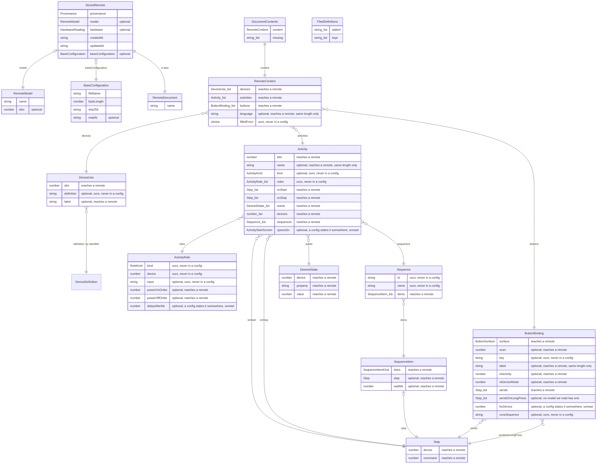
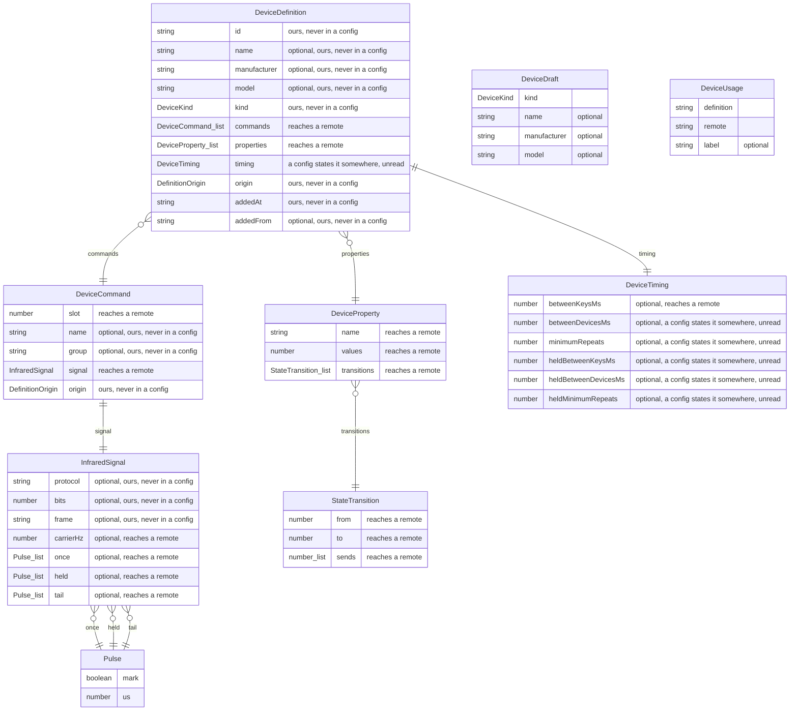

# The document model

Written 21 August 2026 before any of it existed, so that it could be argued with rather than
discovered in the code. **Most of it exists now**, and the sections below say which parts and where.
Nothing here is decided except where it says so.

## The model at a glance

Danny asked for this on 22 August 2026, and the ask was fair: this document argues about the model for
four hundred lines and never shows it. The two diagrams below are **generated from the interfaces**,
by `pnpm model-map --write`, and `pnpm check` fails when they stop matching the source. So they cannot
drift, which is the only reason a picture in a document is worth having.

Read the quoted notes on the fields: they say whether changing that field could ever reach a remote,
and they come from `src/shared/writeback.ts` rather than from anybody's memory.

<!-- model-map:start -->

<!-- Generated by `pnpm model-map --write`. Do not edit by hand: `pnpm check` compares this
     with the interfaces and fails when they disagree. -->

### What a remote document holds

One `RemoteDocument` per folder in your documents. A quoted note on a field says whether a
change to it could ever reach a remote, which is `src/shared/writeback.ts`'s answer and not a
guess.

`DeviceUse.definition` is the one thread out of this diagram and into the next, and it carries an
identifier rather than a structure. That is what makes a document not self contained: anything
moving one to another machine has to take the definitions it names, or say what is missing.

| structure | what it is |
|---|---|
| `BaseConfiguration` | The configuration a remote's entry is based on, described rather than contained. |
| `RemoteModel` | Which remote a document is about. |
| `StoredRemote` | remote.json: everything about a remote that its folder name cannot carry. |
| `RemoteDocument` | A remote as the application handles it: what is stored, plus the name its folder carries. |
| `DeviceUse` | One of the appliances this remote drives./ One of the appliances this remote drives. |
| `ActivityRole` | What one appliance does in one activity, and what state it has to be in to do it. |
| `Step` | Send one command to one device. |
| `SequenceItem` | One step of a sequence: a command going out, or time passing. |
| `Sequence` | A named run of commands and pauses, belonging to one activity. |
| `DesiredState` | What an activity wants one appliance to be doing. |
| `Activity` | Something the remote can be switched into: watching television, listening to music. |
| `ButtonBinding` | One button doing one thing, in one context. |
| `RemoteContent` | Everything a remote is set up to do. |
| `DocumentContents` | What a document holds, as the window is told it. |
| `FiledDefinitions` | What filing a document's appliances into the shared library did. |

### What the device library holds

One `DeviceDefinition` per appliance in the household, however many remotes drive it.

| structure | what it is |
|---|---|
| `Pulse` | One mark or one space, in microseconds. |
| `InfraredSignal` | What a command sends, in the two forms one signal has. |
| `DeviceCommand` | One command an appliance understands. |
| `StateTransition` | One step in an appliance's own state machine. |
| `DeviceProperty` | Something about an appliance that can be in more than one state: whether it is on, which input it is showing. |
| `DeviceTiming` | How fast an appliance can be talked to. |
| `DeviceDefinition` | An appliance, defined once. |
| `DeviceDraft` | What a person can say about an appliance before anything has been taught to it. |
| `DeviceUsage` | One appliance being used on one remote, under the name that remote gives it. |

### The fixed sets of words

| choice | one of |
|---|---|
| `Provenance` | `read-from-device`, `duplicated`, `created-empty` |
| `ActivityKind` | `watch-tv`, `watch-a-film`, `listen-to-music`, `play-a-game`, `other` |
| `RoleKind` | `picture`, `sound`, `channels`, `film`, `game`, `media`, `other` |
| `SequenceItemKind` | `send`, `wait` |
| `ActivityStartScreen` | `commands`, `number-pad`, `gesture-pad` |
| `ButtonSurface` | `keypad`, `screen` |
| `DefinitionOrigin` | `learned-here`, `from-logitech`, `from-a-configuration`, `typed-here` |
| `DeviceKind` | `television`, `receiver`, `player`, `recorder`, `set-top-box`, `game-console`, `computer`, `lighting`, `other` |

<!-- model-map:end -->

## Why the model comes first

A config is a **compiled artefact**. It is the result of somebody's choices, not the choices
themselves, and the remote is its interpreter. So the document is the source and the config is the
output, and the model holding more than a config does is the normal relationship between the two,
not a luxury.

That also means most of this application can be built before anything is compiled. Filling the
model from a remote works today, because reading a config is finished. Everything after that is
interface over the model.

## Three sources, and what each is for

**Logitech's own editor gives the vocabulary.** The client we hold in the lab is the editor people
actually used, and its own model is legible in it: a device is a manufacturer, a model number and a
type, with a list of commands; an activity is a **kind** plus a set of named **roles**, each role
filled by one of your devices, together with what happens when it starts and when it stops; a button
map binds a named button to a command, per device and per mode; and the timings are named, how long
between two key presses, how long between two devices, how many repeats a press needs at minimum.
None of that is copied. It is what the people who built this had learned about the problem, and it
is worth starting from.

**Our own findings say what the remote executes.** That is the floor. Anything the model holds that
cannot be expressed down there can never reach a remote, however sensible it looks on screen.

**And the emitter says what we can put back.** That is the column nobody can guess, and it is
measured below.

## Where it is

`src/shared/library.ts` is the device library, `src/shared/content.ts` is what a document holds,
`src/shared/writeback.ts` is the table below as code, and `src/main/import.ts` fills the model from a
configuration that was read off a remote. The first three are plain data with no library behind them,
by the same rule as the rest of `src/shared`; the fourth is the only file here that turns the library's
values into ours, which is why it sits in the main process.

**And it is wired up end to end now.** `src/main/configuration.ts` reads a configuration off an
attached remote and reads one back off a disk, `src/main/store/library.ts` keeps the appliances in
`Documents/FreeHarmony/devices`, and `src/renderer/src/views/Inventory.tsx` is the first screen in
FreeHarmony that shows somebody their own configuration. The transfer itself is the sibling
repository's `readConfig`, imported through the `@harmony/corpus/read` subpath, because it carries two
checks nothing here should reimplement: the end marker has to sit where the header said, and the
trailer checksum has to recompute.

## The document is the source, and that is now true on disk

Decided on 22 August 2026. **Reading a remote is an import and never a synchronisation**: the way back
is always built from the document, so the two directions are not symmetrical and nothing should be
built as though they were.

Three consequences, each of which is code rather than intent.

**A document holds its own contents**, in `content.json` beside its manifest, written once when an
import lands. Until that day they were worked out from the configuration bytes on every single look,
which was cheap, always consistent, and left nowhere at all for anything a person adds: a television
typed in by hand had no place to be. `src/main/content.ts` is the one writer. The projection survives
as the fallback for a document that has bytes and no contents file, which is what carries the documents
written before the file existed.

**An import replaces everything the document holds**, and says what that is in numbers before it does.
What is never lost is the readings: each one is a file named after the moment it arrived, so an earlier
import can be projected again. This is the known seam getting sharper rather than a new one, and it is
the reason a document records when it was imported.

**Importing is two halves.** `inspectAttached` opens the remote, reads it and writes nothing;
`importInto` writes. Looking and committing have different costs, so somebody who only wants to know
what is on their remote gets the whole answer and leaves no trace. The compatibility refusal runs
**before the device is opened**, since holding somebody's hardware for a minute in order to tell them no
is the wrong order.

### A position on a remote, and who numbers it

`DeviceUse.slot` used to be the configuration's own numbering, because that was the only identity a device
had in a file somebody else compiled. Now the document is the source and a configuration is what will be
built from it, so **the numbering is ours** and an import fills it from the file rather than owning it.

It has to be stable, because three things in the model refer to a device by number and nothing else: a
step in an activity, a wanted state, and a button binding. So a new position takes the next free number
and never the count, which would collide the first time one in the middle was removed.

### A device's map and an activity's map are two maps of the same keypad

**A Harmony has a device mode**, and Danny's picture of it is the one this model is built on: switching to
a device is like reaching for the old remote that came in the box with that appliance. There is nothing
but that appliance on it. So a device's map is one appliance's commands, and nothing else can appear in
it. `CLAUDE.md`'s first section is the operating concept and it comes before this one.

**An activity's map is the mixed one**: any key may carry any command of any appliance you own, which is
what an activity is for.

They are separate maps, authored separately, and Logitech's own software has a page for each. In this
model they are told apart by one field:

| | `surface` | `inActivity` | `inDeviceMode` |
|---|---|---|---|
| a device's own map | `keypad` | absent | absent |
| an activity's map | `keypad` | the activity | absent |
| a key the screen speaks for | `screen` | absent | the page |

Nothing was invented for the first row: `ButtonBinding.inActivity` has always documented its own absence
as device mode's. What changed on 22 August 2026 is that something finally reads and writes it.

**Two appliances holding the same key is not a conflict**, and an interface must not treat it as one. The
television's old remote has a Menu key and so does the amplifier's; you reach one by choosing the
television and the other by choosing the amplifier.

**The file states no device map.** Every keypad binding in the corpus names an activity, 1122 of them
across five configurations and three architectures. Where the remote keeps its device map is open, below,
and must not be guessed at. So an import reconstructs one: an activity's map is the device map plus that
activity's overrides, so where every activity that binds a key agrees, that agreement is the device's own
answer, and 1096 of 1105 pairs across the corpus agree. The nine that do not are left unbound, because a
map with a guess in it is worse than one with a hole. `src/shared/buttonmap.ts`.

Counted per sample in `test/import.test.ts`, which is where the size of that reconstruction shows: the
Harmony One configuration has 220 activity bindings and 145 device map entries, since the same key counted
once per activity there is counted once per appliance here.

**The screen keys are the bigger half of device mode and are not modelled yet.** An old remote has far
more buttons than a Harmony, so what people build in device mode is pages on the screen, a screenful of
commands at a time, for the functions the keypad has no room for. `inDeviceMode` is the configuration's
own page index and nothing may treat it as a device until the reading that says which device a page
belongs to exists.

### A sequence belongs to an activity, and there is no such thing as a device sequence

Said by Danny on 23 August 2026, after checking it in Logitech's own software and finding it was not
what he had assumed either: **a sequence is a property of an activity**, and the only places it can be
reached from are a button or a screen button. It is not a property of an appliance, so there is no
device level sequence to model and none to import.

That fact is not derivable from the files, which is why it is recorded here rather than measured. A
configuration holds an ordered list of sends on a binding and says nothing about who authored it or
where it was offered, so the corpus would agree with either answer.

**An activity owns its sequences**, which Danny stated the same day and which is the part that decides
the shape: an activity defines zero or more of them, a key or a screen button **inside that activity**
may use one, and it can be used nowhere else. Only "TV kijken" has a Netflix sequence and it appears in
no other activity.

So the first version of this section was wrong about the model, and the correction is worth stating
because it was wrong in the direction of doing nothing. It said a sequence was already the shape it
needed, `ButtonBinding.sends` being an ordered list of `Step`. That list is the right shape for **what a
button does** and it cannot be the sequence itself, for two reasons. It has nowhere to put the
sequence's **name**, which is a thing the user types and sees. And two buttons in one activity running
the same sequence would be two identical lists, so the model could not tell that from two buttons that
happen to send the same codes, and renaming or editing the sequence would have to find every copy. That
is this project's oldest neighbouring rule, one derivation in one place, arriving in a data model.

The authored shape that follows. **It was a proposal for a day and it is built now**, on 23 August 2026,
because Logitech's own records turned out to state every part of it:

* `Activity.sequences`, an ordered list. A `Sequence` carries a **name** and its own ordered items. Their
  records agree: sequences hang off the button map of an **activity**, never off the map of a device, and
  each carries a name and a list of actions.
* An item is a send or a **wait**, because a sequence has pauses in it: Danny's is channel two, zero,
  zero, then red, then red, with five seconds in it. So it is not a list of `Step`.
* A binding **refers** to one of its activity's sequences rather than containing it.

**The convenient shape is refuted, and that is the one thing measurement changed.** "A send with an
optional wait after it" needs no invariant policing and would have been the obvious way to avoid a pair of
optional fields. Their two sequences hold 31 items, 26 sends and 5 waits, and two of those 5 make the
shape impossible: one pair of waits is **adjacent**, three seconds then twenty, and one sequence **ends**
on a wait. So a wait is an item in its own right, a sequence may hold a pause that achieves nothing, and
`SequenceItem` carries `does` with two optionals. `sequenceItemIsWellFormed` is the check that owes,
since the alternative shape, a union of two interfaces, can be neither covered by the writeback table nor
drawn by the generated diagram.

**The unit disagrees between their editor and the file, and the model takes the finer one.** Their records
hold whole seconds; the compiled file holds **tenths** of a second, exact on five authored values from one
second to twenty. So `waitMs` is milliseconds, a multiple of 100 ms reaches a remote exactly, and anything
finer cannot be written. The file is ten times finer than their editor ever let anybody ask for.

**Two limits, and they are not the same number.** Their editor stops at 25 items counting waits, and the
longest sequence in the corpus is exactly 25, with 21 sends and 4 waits. That sequence **hangs a Harmony
One for good** when its touch panel is tapped heavily while it runs, three times out of three with the
batteries out each time, against five gentle or untouched runs that all completed. So their own stated
maximum is not a safe bound, and a writer should refuse an oversized sequence rather than warn about it,
bounding it by the expanded instruction count rather than the item count. That is a config the remote
accepts, whose checksums verify, which this project accounts for to the byte, and which can leave a remote
unusable without writing anywhere it should not.

**How their records join a button to a sequence was not captured**, and it is the one loose end here. The
activity map holds both sequences and no button in it refers to either, although both were bound to keys
on the remote at the moment it was read. So `ButtonBinding.runsSequence` is ours by decision rather than by
imitation. It changes nothing about the shape, because a reference is what the two constraints above
demand whatever they called theirs.

**An import cannot produce that form, and that asymmetry is already in this model twice.** A
configuration holds the expanded list of sends on the binding and nothing else: no name, and no way to
tell two buttons sharing one sequence from two buttons with equal lists. So an import fills `sends` and
leaves `sequences` empty, exactly as it fills `wants` and leaves `roles` empty, and for the same reason.
The named form exists only in a document somebody authors here. Whether an editor can ever recover a
name from an imported binding is not a reverse engineering question, it is a "no" the format guarantees.

**Two things the rule constrains that this model still permits.** A binding on a device's own map has no
activity, per the table above, so a multi step `sends` there would be a device sequence, which does not
exist. Unenforced on purpose until the device map reading in the section below exists, since refusing it
now would refuse something no import can produce anyway. And a key the screen speaks for records its
page and **not** its activity, so a sequence on a screen button has nowhere to name the activity that
owns it, which by this rule every sequence has. Either the screen row gains an activity or the page
implies it, and which is true is a reading nobody has made. Both recorded as open rather than resolved,
since guessing here is what the section below is a warning about.

**Why this matters beyond the field.** The interface follows the model: a sequence editor belongs on
the activity, not on the device page. That is the same mistake as the one `CLAUDE.md`'s first section
opens with, where a whole screen was built around a keypad map that belonged to an activity, and it is
worth noticing that it presented itself the same way both times, as a plausible property of an
appliance.

### A command appears once on an activity's screen, and that is an editor rule

Danny established this on 23 August 2026 by trying it: Logitech's software refuses to put the same
command or sequence on a second pad of the touch panel, on any page. It holds for sequences and for
plain commands alike, and a sequence counts as one thing rather than as the codes it sends.

**This is a rule about editing, not about the document**, and that distinction decides where it lives.
Nothing in a configuration records it, so an import can neither check it nor break it, and the model
gains no field. What gains something is the editor: offering a command for a screen page has to refuse
one already placed on another page of that activity, and the message has to say **where** it already is,
because a refusal that does not is a dead end rather than a guide.

The scope is the activity, which took two facts to establish rather than one. The library next door
measured the corpus: no screen page anywhere holds the same send twice, 0 of 1319 pages over 3122
bindings, but a whole config commonly repeats a send across its pages, 39 of 110 distinct sends on one
Harmony One. So the rule cannot mean once per remote, and since the tool really refuses a second pad,
what it counts within is narrower than the remote. `docs/how-a-harmony-works.md` over there carries the
argument.

**The keypad is explicitly the other way, and that is measured rather than assumed.** Danny said it and
the library checked it: within one activity the same command or sequence may go on as many **keys** as
you like. Two bindings sending the same thing appear in **20 of 44** keypad sets in the corpus and in
**0 of 1319** screen pages. So the check belongs to the screen and must never be applied to a keymap,
and the contrast is what makes the screen's zero evidence rather than coincidence.

Two more things a naive check would refuse that the product allows: the same command on a screen page of
two **different** activities, and the same command on a key while it is also on the screen, since those
are separate maps whose scan codes do not even overlap.

### Decided: the order you see is the array's, and the slot is the machine's

Danny, 23 August 2026, giving one of his reasons for not using MyHarmony: **it cannot reorder the
activities or the devices**. So this application must, and saying that out loud settles a modelling
question that would be expensive to answer later.

The trap is that `DeviceUse.slot` and `Activity.slot` are the configuration's own numbering, and every
binding, every step and every wanted state refers to them. So reordering by **renumbering** would rewrite
most of the document, and a renumbering that goes half right produces a document that still parses and
sends the wrong codes, which is section 117's lesson in a different language.

**The decision is that the two orders are allowed to disagree.** `RemoteContent.devices` and
`.activities` are arrays, and their order is the order a person arranged them in. `slot` stays the
identity the configuration knows, untouched by any reordering. Moving a device up the list is then a
permutation of one array and changes nothing else at all: no binding, no step, no wanted state.

**The rule that follows, and it needs to be stated because it is the kind of thing code drifts into:**
nothing may assume `devices[i].slot === i`. It is true of a fresh import and false the moment somebody
drags a row.

Checked rather than asserted, on the day this was written: every lookup in the codebase already goes
through `find((one) => one.slot === x)` and nothing indexes either array by position, so the decision
costs no rewrite. **One place leaks the numbering into the interface** and will read wrongly once
reordering exists: `views/ActivitiesView.tsx` falls back to `position ${slot + 1}` when a device has no
label, which would show a device as "position 3" while it sits first in the list. It wants a name that
does not come from the slot, or the row's own index.

### Where the remote keeps a device's map is open

**No keypad map in any configuration here sends an infrared code outside an activity.** Counted rather than
concluded, since that is the whole difference: of 48 keypad maps in the five files, 21 are installed by
something in the configuration and 16 of those by an activity, and **exactly those 16 send a code**. The
other 32 send nothing at any depth, and ten of them bind fifty or more keys to comparisons and mode
entries, which is a menu rather than an appliance.

**That the keypad is remapped is not in doubt**, since Logitech's own manuals say so and Danny has used it
for years. Only where the map is stored is open, `docs/findings.md` section 151 next door, and it is not to
be closed by inventing a mechanism. The field stays optional and the test states the population, so a
sample that does carry one fails rather than being absorbed.

**Three earlier versions of this section were wrong and the shape of the error was the same each time.** It
said a device's page shows the keypad one activity at a time; then that a change to a device's button must
reach every activity that inherited it; then that it must reach the ones with room for it and name the
rest. All three answered a question about the **activity** map on a page about a device. The measurement
that produced them was correct and could not have said otherwise, which is the point of the rule in
`CLAUDE.md`: a count over these files says what they contain and never what the product does.

`ButtonBinding.inActivity` held the configuration's own **binding set** number until 22 August 2026, which
is a different numbering space: on one Harmony One the activities are 0 to 6 and 8 while the sets holding
their keys are 7 to 15. So every binding named an activity that either did not exist or was the wrong one,
and nothing failed, because a plausible number is exactly what a wrong number looks like. The mapping was
already read next door, on the activity's own record; the closure that pins it is that an activity's device
list and the devices its keys send to come from **different fields** of the configuration and agree on 16 of
16, where shifting the mapping by one in either direction takes that to 3.

`inDeviceMode` is still the configuration's own **page** index and is now named as such. Which device a
screen page belongs to needs a reading nobody has made, so the field says page and nothing may treat it as
a device until that changes.

### A projection has to be written down before it is edited

A document can hold a configuration and no contents file of its own, which is every document written before
that file existed, and it is served by projecting the bytes on demand. The editing path reads the file. So
the first rename or button assignment on such a document **started from nothing**: the page showed four
devices and the edit wrote a document with none.

Nothing failed and nothing could, because starting from empty contents is the correct answer for a remote
nobody has imported into, and from inside one writer the two cases are indistinguishable. So the projection
is settled once, on the way in to the first edit, and after that the file is the truth. It is deliberately
not part of reading: a read that writes is a read nobody can reason about.

### The name of an appliance is not on the appliance

A description read out of a configuration has no manufacturer, no model and not one command name, because a
configuration states none of the three. So a list of them reads "81 commands" four times over with nothing
to choose between, which is what a screenshot of the picker showed on 22 August 2026 and what Danny could
not make sense of.

The words exist, though: **every document calls its appliances something**, and those are what their owner
typed. `library.usage()` is that join, derived on every call and never stored. Storing a name on the
description would mean taking it from whichever remote happened to be imported first, and then being wrong
for every other one.

Which is also why `editContent` creates contents for a document that has none, marked `here`. The case the
shared library exists for is a second remote driving the television the first one taught this machine
about, and that remote has no configuration and will not have one until somebody compiles it. That was
refused until the same screenshot made it obvious.

### The appliance an import recognises

An appliance already in the library keeps everything a person or Logitech's catalogue put on it, because
a configuration states no manufacturer, no model and not one command name. It is recognised by what it
sends, which is a comparison that needs no vocabulary.

**That comparison sorts, and a button reference does not.** A binding does not name a command, it names
*the hundred and twelfth* command of whatever sits in that position, so pointing a position at another
description of the same appliance changes what every button on it sends unless the references are
rewritten onto the codes. Nothing throws and no count moves: the document simply becomes wrong.

`src/shared/relink.ts` is that rewrite and `test/relink.test.ts` is the check, with a control in every
test because a rewrite that did nothing would otherwise pass. It is not a precaution: of the twelve
appliances that appear in more than one configuration in the corpus next door, three are described with
their commands in a different order, and those are four configurations of one remote from Logitech's own
generator ten minutes apart.

**The table is enforced by the compiler**, not by a habit: every entry in `writeback.ts` is a mapped
type over the interface it describes, so adding a field to the model fails the typecheck until somebody
has said what happens to it.

## The model, in plain words

A **document** is one remote.

* **What it is.** Its name, its model, when it was added, where it came from, and the configuration
  we read off it, kept as it arrived.
* **Devices.** One per real appliance. A label, a type, the commands it knows, its timings, and its
  **state machine**: what about it can be in more than one state, how many states each of those has,
  and which commands move it from one to another.
* **A command.** A name, what it sends, and where that came from. What it sends is either a
  protocol and a value, or the measured pulses, and those are two forms of one thing rather than two
  kinds of command.
* **Activities.** A name, a kind, the devices it uses and the role each one plays, and above all
  **what state it wants everything to be in**: the television on and showing input 3, the amplifier on.
  Not a list of commands to send, which is what makes switching activity leave alone what is already
  right.
* **Buttons.** Per activity and per device, which button sends which command. Two populations, the
  keys the screen speaks for and the keys on the keypad, which the format keeps strictly apart.
* **Screens.** What the remote shows: the pages, the words on them, and the artwork.

## What the model holds that a config cannot

This is the list that justifies the whole exercise.

* **The whole command set of a device.** A config keeps only the commands that something is bound
  to. A television knows hundreds.
* **The original learned signal.** A config keeps one chosen encoding of it and the measurement is
  gone. Keeping the capture is what lets us encode it again later, differently.
* **Where a definition came from.** Learned from hardware here, or taken from Logitech. This is
  already decided, and it is decided early because it cannot be established in hindsight: only
  something learned from hardware may ever be shared with anybody.
* **The kind of an activity, and the role each device plays in it.** A config has the resulting
  instructions. That a receiver is the one doing the sound is not in there, and it cannot be
  recovered from the compiled form.
* **The names a person chose**, for a button or a command. The config knows a scan code.

## Can we put it back? Measured, not assumed

Two of our own configurations, one from a Harmony One and one from a Harmony 600, run through
`node packages/codec/bin/emit.ts --detail` in the sibling repository on 21 August 2026. The number is
the share of a structure's bytes that the emitter computes from named fields rather than copying
through as an opaque run. Only the first kind can be produced from a model.

| what the model holds | in the config | rebuilt from fields |
|---|---|---|
| devices and their infrared codes | base slot 5, groups, headers, blocks | 100%, and headers 95% |
| what a button does | base slot 10's action lists | 100% |
| activities and their key maps | base slot 9's sets | 100% |
| the pages and their structure | base slot 6 | 100% |
| device state, which drives everything | base slot 13 | 91% to 94% |
| the names in the config | base slot 0 | 100% |
| timings and parameters | base slot 15 | 100% |
| where a touch lands | base slot 17 | 100% |
| the words on a screen | base slot 11's programs | 21% to 26% |
| the artwork | the picture bank | 0% |
| the typeface | base slot 7's glyphs | 1% |

So everything a person would edit is rebuildable from fields, and the two structures that are not
are the images and the font. That is not a gap in the reading: several different encodings draw the
same image, so re-encoding one produces a valid file that is not the original. An editor carries an
image it did not change through unchanged, which is what it should do anyway.

The screen programs sit in between because the instructions are framed and the pixels and strings
they carry are not.

**And the artwork turns out not to be a constraint at all**, decided on 21 August 2026 on the
grounds that Logitech's own icons are dated and worth replacing rather than preserving. Writing a
picture needs no new reading: the format has a **raw** kind, which is a header and the pixels, and
that is already what most pictures are. Measured on the two configurations above: 65 of a Harmony
One's 98 pictures and 15 of a Harmony 600's 16 are stored raw, and emitting every one of them raw
would grow the whole picture bank by **2%** on the One and by nothing measurable on the 600. So
"generate our own bitmaps" costs a couple of percent of space and no format work, which is a much
cheaper answer than reproducing an encoder we cannot reproduce anyway. What stays true is that a
picture we did not make is carried through untouched, since re-encoding it is the thing that cannot
be done.

## The state machine, which is the part that makes a Harmony feel clever

Pointed out by Danny on 21 August 2026 and it was missing from the first version of this page.

The remote keeps track of what state it believes every appliance is in. An activity does not say "send
these six commands", it says what everything should be doing, and the remote sends only the difference.
That is why switching from watching television to listening to music does not turn the television off
and on again, and why it gets it wrong if you turned the television off with its own remote: its belief
is now stale.

All of it is in the file, per appliance, and the library next door already reads it. Measured on the
four configurations the tests use, 27 properties and 89 transitions:

* a `Power` with two states, on every appliance
* an `Input` with as many states as the appliance has inputs, 19 on one of them
* and per pair of states, which commands to send to make the move

So the model holds this on the **appliance**, because it is a fact about the appliance: a television
with one power button needs a toggle where one with separate buttons does not. And an activity holds the
**wanted state** rather than a list of actions.

**Logitech's own editor agrees, which was checked afterwards rather than copied.** Their records for the
two activities that produced our calibration configurations were read on 21 August 2026. An activity
there carries one **role** per appliance, typed by the job it does, and each role names the input that
appliance has to be switched to, by name, plus its position in the power up and power down order. Their
own lists of actions to run on entering and leaving are **empty on both**. So a role with an input and an
order is the shape, and the commands are what a compiler works out. Two things of theirs the model
adopted on the strength of that: the power order, which was missing and is needed, since an amplifier
that powers on after the television has been told which input to use has missed the instruction; and the
input as a **name** rather than a number, because that is what a person picks and what their television
prints on its own screen.

**One closure worth keeping.** Which appliance a property belongs to comes from the names in the file;
which codes a transition sends comes from the action lists. Those are two unrelated readings, and they
agree on all 89 transitions: not one sends another appliance's code. A single crossing would mean one of
them is wrong, so the count is asserted at zero, and pairing every property with the wrong appliance
makes both tests fail.

**What is still not read**: what an activity wants. The values are in the file, written by the
activity's own enter handler, and it waits on the same open question as its start and stop actions,
which of a key map's handlers is the enter one. There is a candidate answer, that the enter handler is
the one recording the activity as running, and establishing it belongs next door with a measurement
behind it.

## Two things building it taught, both of which would have been wrong

**Marks and spaces are stated, not implied.** The obvious way to hold an infrared code is a list of
durations that alternate, starting with a mark, which is how raw infrared is written nearly everywhere.
Measured across four configurations: of 1729 duration blocks, 599 begin with a **space** and only 154
strictly alternate. Both reasons are ordinary. A code that repeats begins with the gap before it, and a
single duration caps at 32767 microseconds, so a long pause is several spaces in a row. Assuming the
alternation would have silently mangled 91% of the codes in the corpus, and nothing would have failed
until somebody pressed a button.

**There are two kinds of absence and they must not be confused.** What an activity was for, and which
device does the sound in it, are gone because the compiler discarded them: no amount of better reading
brings them back, and that is the argument for the model. But an activity's **start** and **stop**
actions are in the file, in its key map's own enter and leave handlers, and they come out empty today
only because which of three tags is the leave handler has never been established next door. The first
version of the import filled the start actions from the button that starts the activity, which reads
correctly and measures zero, because that button selects the key map and the codes live one hop
further along. So the model marks these two as waiting on a reading rather than as lost, and the test
asserts they are empty, which is what stops the next person filling them from a guess.

## What this means for version 1

Version 1 is read only, so none of this is written to a remote yet. What it does mean is that the
model can be authoritative for everything in the top half of that table from the start, and that the
bytes we read stay authoritative for the artwork and the font. Saving, when it arrives, is a minimal
change against the configuration we read, not a file built from nothing: the codec cannot generate a
config out of nothing and is not going to be asked to.

The one thing to carry per field is whether it can be written back. That belongs beside the model,
not in the emitter, because otherwise we build interface for something that can never reach a
remote.

## The language is a flag, and that is all it is for now

Danny's, on 22 August 2026, and the reason to add it before anything uses it: it cannot be recovered
later from a document somebody has already edited.

A remote's whole interface is in its configuration, in the language of whoever generated it, and
nothing in the file says which. Twelve of the thirteen configurations in the corpus are English and one
is Dutch, which nobody had noticed. So the model carries `language` on the content, as an IETF tag,
filled by the sibling's own inference and absent where the evidence is too thin.

Why it will matter: a third to a half of every configuration's screen pages are the **Help
walkthrough**, a chain asking one question per appliance with two keys branching to the next. The
wording is Logitech's template with the person's own appliance names dropped into it. So anything that
**builds** a page has to build it in the right language, and the service that held Logitech's
translations is the discontinued one.

Why it does not matter yet: an editor makes minimal changes against a configuration that already
exists, and those pages are already in it. As long as no appliance is added or removed they stay
correct and are carried through untouched. It becomes real work at step 6, adding and removing
appliances and activities.

**It is the one field in the writeback table that is not one place in the file**, and the table says
so. There is no language field to change: the language is every word the remote shows, so changing it
means regenerating all of them.

## Decided: the device library sits outside the document

Settled on 21 August 2026. A device definition lives in a library beside the documents, and a
document refers to it. The same television is in three documents and is defined once; it is the unit
a shared collection would exchange, and the unit provenance is recorded on, so it is the same object
in both directions.

Three things follow, and they are work rather than objections.

* **A document is no longer self contained.** Anything that moves a document to another machine has
  to take the definitions it refers to, or say what is missing. A folder that cannot be opened
  because a device is unknown would be the failure to avoid.
* **A definition can change under a document.** Teaching a better code for a television improves
  every document that uses it, which is the point, and it also means a document can stop matching
  the configuration that was built from it. Which of the two a change is has to be a stated answer
  and not an accident.
* **Provenance lives in the library**, one flag per definition, and only something learned from
  hardware may ever be shared. That was already decided; putting the definitions in one place is
  what makes it enforceable rather than a convention.

### Decided: the word on the screen is "device"

Settled by Danny on 22 August 2026, against the argument that the interface had been using: a
configuration means two different things by one word, the thing in your living room and the position on
the remote that drives it, so the screens called the first an **appliance** to keep them apart.

The objection is stronger than the distinction. Every remote, every manual and every page anybody has
ever read about these remotes says **device**, so a screen that says appliance is asking its reader to
learn a word in order to use it. The distinction is real and it stays, in the model and in the code, where
`DeviceDefinition` is the thing and `DeviceUse` is the position; what it does not get to do is show up on
a screen. So the entry is the **Device library**, a tile in it is a device, and a tile on a remote's own
page is a position on that remote.

The prose below still says appliance in the places where it means the physical thing rather than a
position, because that is the sentence's whole point. Nothing a user reads does.

### What an appliance is called, decided by building it

**A definition is named after what it sends**, hashed, so the identifier is a property of the appliance
and not of the read that found it. Three consequences, and all three are what was wanted: reading the
same remote twice leaves the library exactly as it was, the same television on two remotes is one
definition, and renaming a document changes nothing.

It was **not** the first answer. The identifier started as the document's name plus a position, which
a test caught immediately: a remote called `living room` produced `living room-device-0`, and the store
refuses that because an identifier is a file name. Spelling it acceptably would have hidden the real
fault, which is that a definition's identity is permanent and a document's name is something a person
changes on a whim.

**An appliance with no commands falls back to the configuration's digest**, and it has to. Every
appliance nobody has taught anything to sends the same nothing, so addressing them by content would
make them all one definition. There is no content to address, so the read that found it is the honest
identity.

**A definition has a name of its own, and it is not the same as its label.** Added on 22 August 2026
when the library got a screen, for the case that makes the two necessary: two televisions of one model,
one of them with its sound going through an amplifier. They send the same codes, so an import makes
them one description, and telling them apart has to be a deliberate act. Copying one is that act, and a
copy with no name of its own is one row twice over in every list. The label stays what it always was,
the word one remote uses for one position, and four identical televisions on four remotes are still one
description under four labels.

**An appliance can be written down by hand, with no codes at all**, which is what the fourth origin is
for. Not one of the three that existed: nothing was learned from hardware, nothing came from Logitech,
and nothing was read out of a configuration, so filling in any of them would put a falsehood in the one
field this model cannot repair afterwards. It may never be shared, and that stays true even once
somebody teaches it codes, because by then where those came from is a question nobody kept the answer
to. It exists because an appliance does not have to be complete to be worth recording, which is the
ordinary state of things until the application can learn a code.

**Its identifier is random, and the two obvious alternatives are both wrong.** The lowest free number
**reuses** one after a delete, so a document still naming the old appliance would quietly be pointing at
a different one, with every button on it sending the wrong thing and nothing to say so. A digest of the
typed words would make two amplifiers nobody has distinguished yet a single row, and would move the
identity the moment somebody fixed a spelling. So it is random, never reused, and never changed. The
price is stated rather than hidden: teach codes to a hand written appliance and it keeps that
identifier, so an import of the same codes elsewhere writes a second description of one appliance. That
is what the duplicate report below is for.

**Where it came from is recorded twice over, once as a class and once as a model.** `origin` was already
one of four values and it is what decides whether a definition may ever be shared. `addedFrom` was added
on 22 August 2026 and holds the **model** of the remote a definition was read off, so a page can say
"imported from a Harmony 600" instead of "imported from a remote". Two things about it are deliberate and
neither is obvious. It records the **model** and not the document's name, because a document gets renamed
and deleted and the sentence would then name something that no longer exists. And it records the
**first** import and never a later one: a definition is shared by every document that refers to it, so
overwriting it on a second import would make the field say whichever remote was read most recently, which
is a fact about the reading rather than about the device.

**A label is optional, and that is a change.** A position on a remote used to be expected to carry the
name that remote's owner typed, because a configuration always has one. A position created from the
library has no such name, and demanding one before the device can be added would make the shortest route
into the library the one with a form in it. So a position with no label shows the library's name for the
device, and typing one is how you say "this one is the bedroom television" when two positions would
otherwise read the same. Renaming it afterwards is the same edit it always was.

**A kind is a picture and nothing else.** Nine of them, the categories Logitech had, each with a
drawing. Worth knowing before reading a screen: **a configuration does not say what a device is**, so
everything an import produces is `other`, and a freshly imported library draws one picture nine times.
That is honest rather than a gap, and it is why the form that lets somebody set one arrived in the same
week.

**Nothing is ever overwritten and nothing is merged.** Filing the appliances of a document that has
already been filed reports them as kept, because a definition may have been corrected by hand since it
arrived. And two definitions that send the same things are **reported** as probably one appliance and
never joined: merging changes what every document pointing at either one is pointing at, which is a
decision for a person.

Whether that library is ever shared with other people is still open, and nothing above depends on
it.

## Holding a key is two different things, and only one of them is a button's business

Danny put this together on 23 August 2026 from the Logitech interface: there are keys that do nothing
extra when you hold them, keys that keep firing while you hold them, and keys that do something
**different** when you hold them. Three behaviours, and it is tempting to model them as three kinds of
key. They are not. They are two independent mechanisms and only one of them belongs to a button.

**Repeating while held is a property of the code**, so it belongs to the device definition and not to
the binding. An infrared record in a configuration carries three parts: what is sent once on a press,
what is sent for as long as the key stays down, and a tail. The library next door reads all three.
The volume key repeats because the middle part is filled in, and the interval you feel is that part's
own length. So one appliance can have a repeating volume command and a non repeating power command,
and no button anywhere had to say so.

**A long press is a property of the button**, and it is a second action selected by how long you hold
it. `ButtonBinding.sendsOnLongPress` carries it. The two cannot coexist on one key, and the reason is
mechanical rather than a rule somebody wrote: a firmware that must decide between two actions has to
wait to see which one you meant, and a key that is waiting cannot also be repeating. So Danny's third
kind of key is not a kind at all, it is a key whose long press has taken its repeat away.

**No model this application can read has a long press**, and the field is therefore always absent
after an import, asserted over 1555 bindings in `test/import.test.ts`. It is a generation boundary
rather than a price tier: the feature arrives with the Touch generation and no earlier model declares
it.

**Which models have it is not written down here**, and that is deliberate since 24 August 2026. It is a
per model capability, so it belongs in the library next door with the rest of them:
`reference/capabilities.md` carries the list and the standing, and `hasLongPress` in `@harmony/usb` is
its executable form, with a test asserting that no model this application can reach is on it. A list of
models in this file would be the same fact twice, in the repository that does not own it and cannot test
it, which is how it started.

The field is here anyway, and that was a decision rather than an omission of caution. It costs one
line now against a change to everything hanging off a binding later, and the two models most likely
to be supported next both have it. Which brings the reason it is worth carrying at all:

**On the 350 the long press is what the device count is made of.** Four device buttons times two
presses is exactly its stated maximum of eight devices, where the 300 has four buttons, no long press
and a maximum of four. One mechanism explains numbers that otherwise look like entries in a table, and
a model that could not express a long press would have to treat the 350's eight as arbitrary. The
counts are the vendor's and are recorded with the capability, next door.

**A double press is deliberately not modelled.** Logitech's own button record carries a third field
for it, beside the press and the hold, so the concept certainly exists in their software. What is
missing is anything that uses it: no product record advertises it, and no configuration in the corpus
holds one. A field with no evidence behind it is a guess wearing a type, and the note here is worth
more than the field would be, because it says where to look if one ever turns up.

## Which models this could grow to, and the one that decides it

Written down on 23 August 2026 because the question came up as "why would we not support the long
press models", and the honest answer is that the long press is not what decides it. Reading the
configuration is.

Three groups, and they are not alike:

**The 200, 300 and 350 are reachable through a different door.** They are ordinary USB devices and the
transport in the library next door already reaches them. What they do not have is an address space: a
configuration is fetched as a **named file** rather than read address by address, and every request
about memory or firmware is refused. The end marker the existing tooling expects from them is the same
one our own remotes use, so the container appears to have survived into that generation and a reader
may need very little. Nobody here has ever seen one of those files.

**The Touch, the Ultimate One and the 950 sit in that same family** by the same classification, so the
same door. Unknown beyond that, and one compiled configuration would settle whether the format is
shared.

**The Elite and Smart Control families stay outside the promise**, and this is a scope decision rather
than a technical limit. Their configuration lives on Logitech's servers and reaches a hub over the
internet; there is nothing on a desk to read or to write. Supporting them means reimplementing a cloud
service, which is a different product. They also still work, which is the problem this application
exists to solve and the one they do not have.

What none of those groups gives is **firmware or live memory**, both refused. So they can consume what
is already understood and they cannot settle anything new, and any question that needs the firmware as
its authority has to be answered on a remote from the older family first.

## A button does one of two things here, and one of three in Logitech's model

Read out of their own button records on 23 August 2026, for three of the models this application reads.
Their division is three ways: a button **sends** commands, it **runs** one of its activity's sequences, or
it **tunes** to a favourite channel. Of 654 buttons across 10 button maps, 651 carry a command action and 3
carry a channel action, with the sequences held on the activity beside them.

This model takes two of the three, and the section below says why the third is deliberately missing. So
`ButtonBinding.sends` may be empty on an authored binding, which it could not be before, and exactly one of
`sends` and `runsSequence` says what a button is for. Only the first survives an import.

**Decided: there are no favourites in this model, because a sequence is one.** Their records split a
button's action three ways and this model has two. The third is a **favourite channel**, a channel put on a
screen pad, and Danny's answer on 23 August 2026 was that he has never used the feature, does not know how
to switch it on, and never understood the need for it, since a sequence does the same thing. That premise
holds: tuning to channel 100 is sending that appliance's one, zero and zero, which is exactly the shape of
the sequence he authored, and a second way to say one thing is a second thing to keep right.

**It was built first and taken out the same afternoon**, and the sequence of mistakes is worth keeping
because each was found by him looking rather than by a test. The first version had the channel as a bare
string on the binding, so the word "favourite" appeared nowhere in the generated diagram. He asked why, and
the question about the drawing turned out to be about the model twice over: a favourite has a **title** and
an optional **picture**, neither of which can live on a channel number, and the field claiming to name the
appliance being tuned, `forDevice`, could not do it either, because their favourites sit in a menu named
after no appliance while a device's commands sit in a menu named after the device. So an entity was built.
Then he pointed out it was redundant, and it went. `forDevice` stays and its wrong reading does not.

**Three things a sequence cannot do, none of which changed the answer.** A favourite belongs to the
appliance, so it is reachable in device mode and from any activity, where a sequence belongs to one activity
and would have to be repeated in each. A favourite can carry a **picture**, and a sequence cannot, which on
a colour touch panel is arguably the whole point of the feature. And a favourite compiles through the
number sender, a record per appliance plus a short list per channel, where a sequence is spelled out per
binding, so a wall of channels is much smaller in the file the vendor's way; their own capability table caps
favourites at eighteen on some models, which suggests they cared.

The last of those is a **compiler** concern rather than a model one, and that is what makes the decision
cheap: anything emitting a configuration can notice that a sequence is nothing but one appliance's digits
and choose the compact form, with nothing in the model saying so. The first is real and small. The second
is the one that would bring the question back, and if pictures on pads ever matter the field belongs on the
**pad**, which is where Logitech puts theirs: a screen button of theirs carries an image key, a path and an
image id, all three unset on all 318 screen buttons in their records. So the picture is available and
unevidenced, and it is not modelled.

**What is not lost is the knowledge**, and it lives next door in `how-a-harmony-works.md` because it is
about the product rather than about this model: what a favourite is, that the channel is text because
channel 1 and channel 001 are different channels and a configuration takes two entirely different routes
for them, and that it reaches the file as instructions in four separate sections with nothing saying a
channel was ever typed. So a favourite could never have been read back anyway, which means dropping the
entity costs an import exactly nothing.

## A key has a name, and the name is the identity everywhere except in the file

All 336 keypad buttons in their records carry a `ButtonKey`, a word: `VolumeUp`, `Menu`, `Number1`. None
carries a scan code. The sibling repository's reading of the firmware says why, since a host named a
button and the firmware resolved the name to hardware, which is also why neither of Logitech's own
applications ever held the scan code map.

**This matters for more than tidiness.** A scan code is a position in one model's wiring, so a document
whose bindings are scan codes cannot be carried to another remote: every binding would point at the
wrong key. A name is the same key on every remote that has one. Given that this application intends to
support a dozen models, `ButtonBinding.key` is what makes moving a configuration between them thinkable
at all, and it costs one optional field now.

Their spelling, deliberately. It is the one vocabulary that already covers every model, it is what a
fetched button map speaks, and inventing our own would mean a translation table nobody could check.

**Absent after an import, and the joining table is why.** The file states the scan code; the name is what
the compiler resolved it from. That join is measured for 32 keys of a Harmony One and 36 of a Harmony
600 and for nothing else, so filling it in is possible for some keys of some models and is not
attempted. `reference/button-maps.md` next door is that table, and it is honest about the scans two keys
share by listing them as sets rather than assigning them.

## Which appliance a screen button is for, stated at last on one side

Every one of the 318 screen buttons in their records sits in a **named menu**, and the names are of three
shapes: `Device.<id>` on 314 of them, `Activity.<id>` on one, and `FavoriteChannels` on three. So their
model puts a screen button on an appliance, which is exactly the question this document has had open
under "Where the remote keeps a device's map is open".

**It closes the authored half and not the read half, and the two must not be confused.**
`ButtonBinding.forDevice` is the appliance an author chose. `inDeviceMode` is still the page number the
configuration states, and which page belongs to which appliance is still a reading nobody has made.
Nothing may derive one from the other until it exists. This is the same asymmetry as `roles` against
`wants` and as `sequences` against `sends`, and it now appears three times, which is a sign it is the
shape of this model rather than an accident of one field.

**Their `IndexInMenu` gets no field, and the reason is a decision already taken here.** A screen button
carries its position in its menu. Under "the order you see is the array's, and the slot is the machine's"
that position is the order of `RemoteContent.buttons`, and adding a number beside it would be a second
statement of the same thing, which is the copy that rots. So the position is the array's and the import
preserves it.

## The activity vocabulary was a sample and is now complete

`RoleKind` had four names, taken from the two activities that produced our calibration configurations,
and said out loud that four observations are not a vocabulary and that a games console would need
something. Reading a whole account's activity records produced exactly that. 22 roles across 7
activities carry **six** distinct names, and the four were right: a display doing the picture, a volume
role doing the sound, a channel changing role and a play movie role, plus `PlayGameActivityRole` and
`PlayMediaActivityRole`. So a games console was landing on `other` in a model that now has a name for it,
and `media` is worth telling apart from `film` because a streaming box and a disc player are both playing
something and Logitech separates them.

`other` stays and its standing has changed: it is a hedge against a seventh name rather than against the
four being wrong, and nothing in the corpus uses it.

**`ActivityKind` needed no change at all, which is the calibration worth recording.** Its five values were
chosen from their editor's wording and their records carry five activity types: `WatchTV`, `WatchDvd`,
`PlayGame`, `ListenToMusic` and `Custom`. Five for five, with `other` being their `Custom`. A guessed
vocabulary matching the real one exactly is the sort of thing that only counts when it was checkable, so
it is recorded here rather than assumed to have been obvious.

**An activity opens on a named screen**, `ActivityStartScreen`, which is their `StartScreen` and is stated
on all 7 activities read, three distinct values appearing: their `Commands` four times, `Numpad` twice and
`Gesturepad` once. It is a real per activity setting rather than a default nobody touched. Absent on an
import: the mode an activity enters is in the file and which of the three named screens that mode is, is
not established, so filling it in would be a guess about the one field whose value is visible the second an
activity starts.

**`ActivityRole.delayAfterMs` is confirmed as belonging on the role and is still unmeasured.** Their field
is called `NextDevicePowerOnDelay` and it sits on the role exactly where this model put it, which settles
that it is a property of one appliance's job in one activity rather than of the appliance. It is null on
all 22 roles, and that is why no compiled file can be searched for it: there is no value in the corpus for
a pause in an action list to be recognised by. One activity with a delay nobody else has would settle it in
a single compile.

## Six timing numbers, not three, and three of them are unmeasurable today

`DeviceTiming` had the three an appliance record shows in their editor's timing panel. It has six, and the
three that were missing are the **held** variants: `HoldInterKeyDelay`, `HoldInterDeviceDelay` and
`HoldMinRepeats`, per appliance, beside the three we had.

They are here so a document can hold what their editor held, and what they do is not established. The one
measurement says they do not vary: across the six appliances read, the hold delay between keys is 100 ms on
every one, the hold delay between appliances is 0 on every one and the hold repeat count is 0 on every one.
So there is no multiplicity for a compiled file to be matched against, which is the same obstacle
`betweenDevicesMs` has, and one appliance set to a value nobody else has would settle four fields at once.

**Three different things get called holding a key**, and the model keeps them apart in three places, which
is worth stating once because the names invite confusion. Whether a code **repeats** at all is a property
of the code, `InfraredSignal.held`, because an infrared record carries a block sent once and a block sent
for as long as the key is down. A **long press** is a second action on a button, `sendsOnLongPress`, and a
button with one cannot repeat because the firmware has to wait to find out which you meant. And how fast a
held key's repeats may leave the remote is these three fields, on the appliance.
